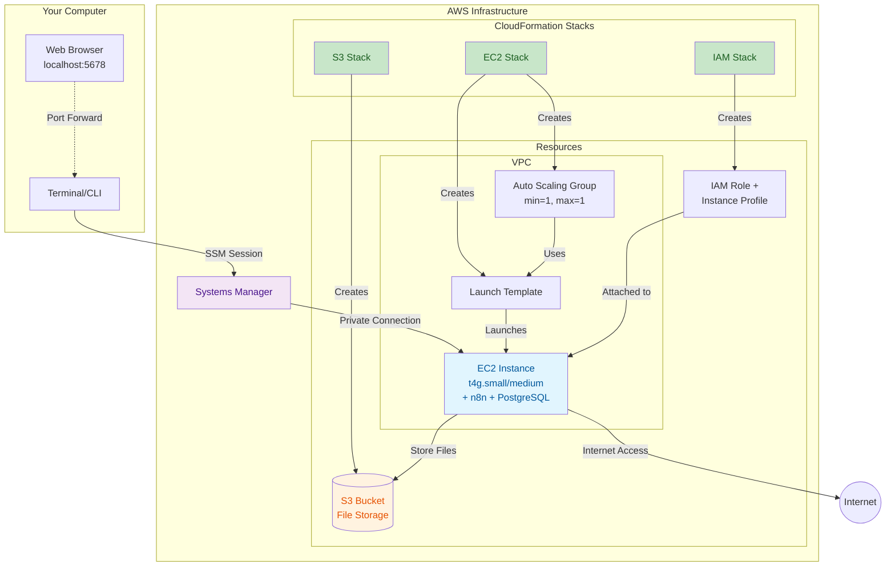

# n8n Self-Hosted Workflow Automation

Self-hosted n8n automation stack with secure AWS deployment, PostgreSQL support, and full CloudFormation infrastructure.

## Table of Contents

- [Why This Solution?](#why-this-solution)
- [Features](#features)
- [Quick Start](#quick-start)
  - [Local Development](#local-development)
  - [Switching Database Backends](#switching-database-backends)
- [AWS Deployment](#aws-deployment)
  - [Architecture](#architecture)
  - [Prerequisites](#prerequisites)
  - [Deployment Steps](#deployment-steps)
- [Project Structure](#project-structure)
- [Configuration](#configuration)
- [Backup and Restore](#backup-and-restore)
- [Troubleshooting](#troubleshooting)
- [Extend This Stack](#extend-this-stack)
- [Contributing](#contributing)

## Why This Solution?

- 💰 **Cost-Optimized**: $5-10/month vs $25+ for managed solutions
- 🔒 **Secure by Default**: Private subnet deployment, SSM access only, no public IPs
- 🚀 **Production-Ready**: Auto-healing via ASG, automated backups, CloudWatch monitoring
- 🛠️ **Zero Lock-in**: Your data, your infrastructure, export and migrate anytime
- 📦 **Simple Architecture**: Just EC2 + PostgreSQL, no Kubernetes complexity
- ⚡ **Infrastructure as Code**: Fully automated CloudFormation deployment
- 🎯 **Single-Command Deploy**: From zero to running in ~5 minutes

## Features

- Docker Compose based deployment
- PostgreSQL backend 
- Automatic encryption key generation
- Persistent data storage
- AWS CloudFormation templates for production deployment
- Secure AWS deployment with SSM port forwarding

## Quick Start

### Local Development

1. Clone this repository:
```bash
git clone https://github.com/cunicopia-dev/n8n-aws-self-hosting.git
cd n8n-aws-self-hosting
```

2. Run the installation script:
```bash
# With SQLite (default)
./install-n8n.sh

# With PostgreSQL
./install-n8n.sh --postgres
```

3. Access n8n at http://localhost:5678

### Switching Database Backends

To switch from SQLite to PostgreSQL after initial setup:

1. Edit `.env` file and change:
   - `DB_TYPE=sqlite` to `DB_TYPE=postgresdb`
   - Uncomment and configure the PostgreSQL settings

2. Restart with PostgreSQL profile:
```bash
docker compose down
docker compose --profile postgres up -d
```

## AWS Deployment

### Architecture



### Prerequisites

- **AWS CLI**: [Installation guide](https://aws.amazon.com/cli/)
- **AWS SAM CLI**: [Installation guide](https://docs.aws.amazon.com/serverless-application-model/latest/developerguide/install-sam-cli.html)
- **Docker** and **Docker Compose** (for local development)
- AWS credentials configured (`aws configure`)
- VPC with at least one subnet
- Appropriate AWS permissions for CloudFormation, EC2, S3, IAM, and SSM

> 💰 **Estimated Cost**: ~$10/mo using `t4g.small` + ~8 GB storage.  
> This setup is ideal for lean, production-grade automation infrastructure without the managed service tax.

### Deployment Steps

You have two options for deployment:

#### Option 1: Manual Deployment (Recommended for understanding what's happening)

1. Deploy the S3 bucket:
```bash
cd infra
aws cloudformation create-stack \
  --stack-name n8n-s3 \
  --template-body file://s3.yaml
```

2. Deploy IAM roles:
```bash
aws cloudformation create-stack \
  --stack-name n8n-iam \
  --template-body file://iam.yaml \
  --capabilities CAPABILITY_NAMED_IAM \
  --parameters ParameterKey=S3BucketArn,ParameterValue=$(aws cloudformation describe-stacks --stack-name n8n-s3 --query 'Stacks[0].Outputs[?OutputKey==`BucketArn`].OutputValue' --output text)
```

3. Deploy EC2 instance:
```bash
aws cloudformation create-stack \
  --stack-name n8n-ec2 \
  --template-body file://ec2.yaml \
  --parameters \
    ParameterKey=VpcId,ParameterValue=vpc-xxxxxx \
    ParameterKey=SubnetId,ParameterValue=subnet-xxxxxx \
    ParameterKey=InstanceType,ParameterValue=t4g.small \
    ParameterKey=InstanceProfileName,ParameterValue=$(aws cloudformation describe-stacks --stack-name n8n-iam --query 'Stacks[0].Outputs[?OutputKey==`InstanceProfileName`].OutputValue' --output text) \
    ParameterKey=S3BucketName,ParameterValue=$(aws cloudformation describe-stacks --stack-name n8n-s3 --query 'Stacks[0].Outputs[?OutputKey==`BucketName`].OutputValue' --output text) \
    ParameterKey=UsePostgres,ParameterValue=false
```

4. Get your instance ID:
```bash
# Wait a minute for the instance to launch, then:
ASG_NAME=$(aws cloudformation describe-stacks \
  --stack-name n8n-ec2 \
  --query 'Stacks[0].Outputs[?OutputKey==`AutoScalingGroupName`].OutputValue' \
  --output text)

INSTANCE_ID=$(aws autoscaling describe-auto-scaling-groups \
  --auto-scaling-group-names "$ASG_NAME" \
  --query 'AutoScalingGroups[0].Instances[0].InstanceId' \
  --output text)

echo "Your instance ID is: $INSTANCE_ID"
```

5. Connect to n8n:
```bash
# Terminal 1 - SSH into the instance (optional)
aws ssm start-session --target $INSTANCE_ID

# Terminal 2 - Port forward n8n
aws ssm start-session \
  --target $INSTANCE_ID \
  --document-name AWS-StartPortForwardingSession \
  --parameters '{"portNumber":["5678"],"localPortNumber":["5678"]}'
```

6. Access n8n at http://localhost:5678

#### Option 2: Automated Deployment Script

If you prefer automation, there's a simple deployment script:
```bash
cd infra
./deploy.sh --vpc-id vpc-xxxxxx --subnet-id subnet-xxxxxx
```

Add `--postgres` to use PostgreSQL instead of SQLite.

## Project Structure

```
n8n-aws-self-hosting/
├── docker-compose.yml      # Docker Compose configuration
├── install-n8n.sh         # Installation script
├── .env                   # Environment configuration (created on first run)
├── n8n_data/             # n8n persistent data
├── local-files/          # Local file storage
├── workflows/            # n8n workflow exports
├── prompts/             # Prompt templates
└── infra/               # AWS CloudFormation templates
    ├── s3.yaml          # S3 bucket configuration
    ├── ec2.yaml         # EC2 instance configuration
    └── iam.yaml         # IAM roles and policies
```

## Configuration

### Environment Variables

Key environment variables in `.env` (see `.env.example` for all options):

- `N8N_ENCRYPTION_KEY`: Auto-generated encryption key for credentials
- `DB_TYPE`: Database type (`sqlite` or `postgresdb`)
- `DB_POSTGRESDB_*`: PostgreSQL connection settings
- `GENERIC_TIMEZONE`: Timezone setting (default: UTC)

For a complete list of configuration options, check `.env.example` which includes:
- External database connections (RDS)
- Basic authentication
- Email/SMTP configuration
- Webhook settings
- S3 file storage
- Execution timeouts

### Security Considerations

- Encryption key is automatically generated on first run
- PostgreSQL passwords are randomly generated when using `--postgres` flag
- AWS deployment uses SSM for access (no SSH keys or public IPs)
- Security group allows outbound traffic only

## Backup and Restore

### Local Deployment

SQLite:
```bash
# Backup
cp -r n8n_data n8n_data_backup

# Restore
cp -r n8n_data_backup n8n_data
```

PostgreSQL:
```bash
# Backup
docker compose exec postgres pg_dump -U n8n n8n > backup.sql

# Restore
docker compose exec -T postgres psql -U n8n n8n < backup.sql
```

### AWS Deployment

Use AWS Systems Manager to run backup commands on the EC2 instance, storing backups in S3.

## Troubleshooting

### Common Issues

1. **Port already in use**: Change the port mapping in `docker-compose.yml`
2. **Permission denied**: Ensure proper permissions on `n8n_data` and `local-files` directories
3. **Database connection failed**: Check PostgreSQL container health and credentials in `.env`

### Logs

View logs:
```bash
# All services
docker compose logs -f

# Specific service
docker compose logs -f n8n
docker compose logs -f postgres
```

## Contributing

1. Fork the repository
2. Create your feature branch (`git checkout -b feature/amazing-feature`)
3. Commit your changes (`git commit -m 'Add amazing feature'`)
4. Push to the branch (`git push origin feature/amazing-feature`)
5. Open a Pull Request

## License

This project is licensed under the MIT License - see the LICENSE file for details.

## Extend This Stack

- 📦 Replace local Postgres with external RDS or Aurora
- 🔁 Use GitHub Actions + SAM CLI for CI/CD deploys
- 📊 Send logs to CloudWatch or Loki
- 🤖 Integrate Ollama or Bedrock into workflows
- 🔐 Add secrets management via AWS Parameter Store
- 🌐 Put behind Application Load Balancer for team access
- 📈 Add CloudWatch dashboards for monitoring
- 🔄 Implement automated backups to S3